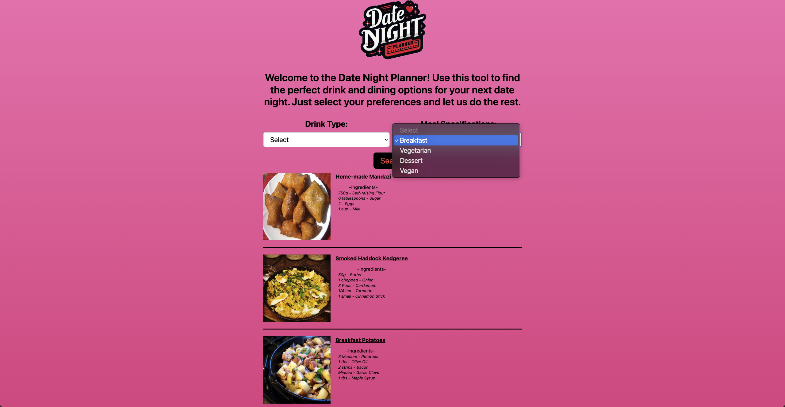

# Date Night Planner

## Introduction
The Date Night Planner is an innovative web application meticulously crafted to assist both couples and individuals in orchestrating an idyllic date night experience. By facilitating the selection of movie genres and meal types, the platform ensures users are presented with custom-tailored recommendations, thereby enhancing their evening with memorable and enriching options. This application streamlines the decision-making process and unveils novel possibilities that users may not have previously contemplated.

## Features
**Curated Movie Selection:** Engage with an extensive array of film genres to discover a movie that resonates with your current disposition. Whether you're in the mood for a thrilling adventure, a heartwarming romance, or a belly-aching comedy, our curated selection ensures you find the perfect cinematic experience to complement your evening.

 **Personalized Meal Recommendations:** Receive bespoke suggestions for culinary delights that cater to your specific dietary preferences. From sumptuous vegetarian dishes and indulgent desserts to health-conscious vegan options, our platform is designed to accommodate a diverse range of culinary tastes and requirements.

 

 **Responsive Design for All Devices:** Experience flawless functionality across a multitude of devices with our mobile-friendly and responsive design. Whether planning your date night on the go or from the comfort of your home, our platform guarantees a seamless user experience devoid of compromise.

 

 ## The Date Night Planner stands as a testament to our commitment to enhancing your date night experience by delivering personalized, thoughtful recommendations that cater to your unique preferences and desires.
links:
https://github.com/Tabi-Led/DateNightPlanner
https://tabi-led.github.io/DateNightPlanner/

Breakdown of tasks 
Adama- CSS 
Donte- Javascript - recipe side 
Joe- HTML
Tabi- Javascript- movie side 

